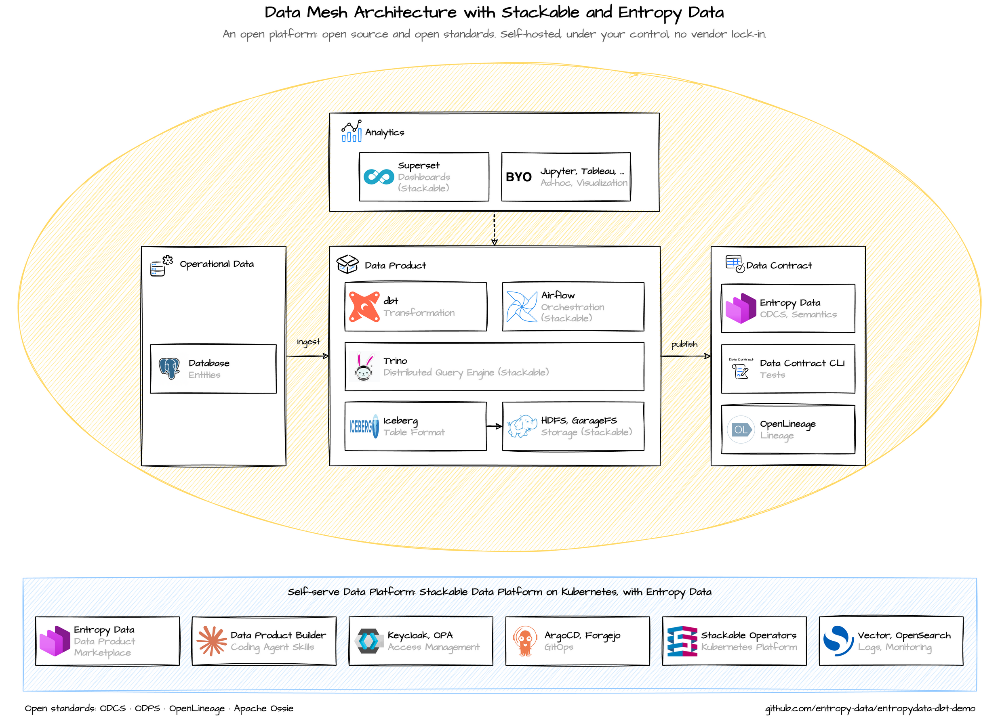

# Daten-Produkte bauen auf einer offenen Plattform: Stackable + Entropy Data

Viele Unternehmen wollen eine moderne Datenplattform, ohne sich an einen Anbieter zu binden. Unsere Demo zeigt, wie das geht: eine offene Plattform aus Open Source und offenen Standards, selbst gehostet und vollständig unter eigener Kontrolle.

Die Stackable Data Platform betreibt bewährte Open-Source-Komponenten wie Trino, Airflow und Kafka auf Kubernetes. Darauf entstehen Daten-Produkte, die aufeinander aufbauen. Entropy Data macht sie als Marktplatz auffindbar und verwaltet Data Contracts, Semantik, Lineage und Zugriffe. Alles basiert auf offenen Standards wie ODCS, ODPS und OpenLineage. Sicherheit und Support sind abgedeckt, ein Vendor Lock-in entsteht nicht.

Im Video bauen wir eine „Nation Scorecard“, und zwar contract-first. Zuerst beschreibt der Data Contract, was entstehen soll. Über den Marktplatz verbinden wir die vier Daten-Produkte, auf denen die Scorecard aufbaut. Die Umsetzung übernimmt ein Coding Agent: Er kennt über Skills die Konventionen der Plattform und erhält eine einzige Anweisung: „Implementiere das Daten-Produkt.“ Nach wenigen Minuten ist es gebaut, getestet und veröffentlicht, inklusive Lineage.

Die Rolle des Menschen verschiebt sich damit: weg vom Programmieren, hin zur Frage, was gebaut werden soll und welchen Wert es stiftet.

Wer tiefer einsteigen will: Die gesamte Demo ist offen auf GitHub verfügbar, inklusive Architektur, Daten-Produkten und Skills.
https://github.com/entropy-data/entropydata-dbt-demo

## Sprechen wir darüber

Du möchtest eine offene Datenplattform aufbauen oder Daten-Produkte contract-first entwickeln? Melde dich bei uns:

- **Stackable Data Platform:** Sönke Liebau, CPO & Co-Founder von Stackable. [LinkedIn](https://www.linkedin.com/in/soenkeliebau/)
- **Entropy Data:** Simon Harrer, CEO & Co-Founder von Entropy Data. [LinkedIn](https://www.linkedin.com/in/simonharrer/)
