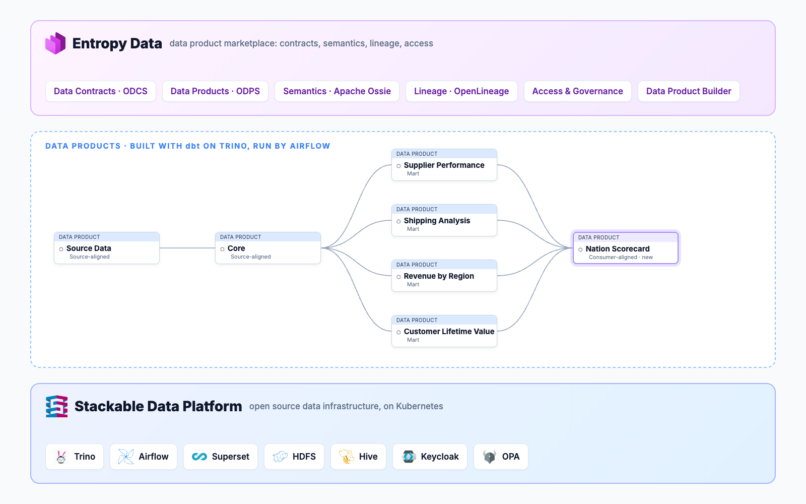
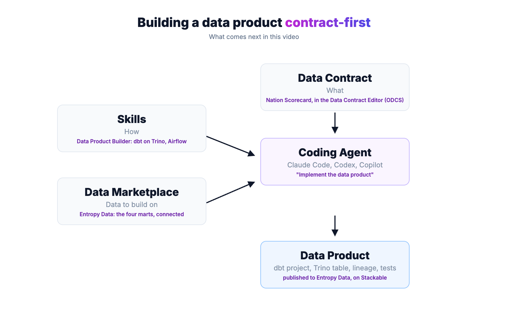

# Daten-Produkte bauen auf einer offenen Plattform: Stackable + Entropy Data

Viele Unternehmen wollen eine moderne Datenplattform, ohne sich an einen Anbieter zu binden. Proprietäre Cloud-Angebote sind schnell eingerichtet, doch Daten, Logik und Wissen landen in einem geschlossenen System. Unsere Demo zeigt einen anderen Weg: eine offene Plattform aus Open Source und offenen Standards, selbst gehostet und vollständig unter eigener Kontrolle.

## Die Plattform: Stackable

Die Stackable Data Platform bildet das Fundament. Sie betreibt bewährte Open-Source-Komponenten wie Trino, Airflow, Kafka, NiFi und Superset auf Kubernetes, egal ob im eigenen Rechenzentrum oder in der Cloud. Die Komponenten sind aufeinander abgestimmt, sicher konfiguriert und werden per GitOps ausgerollt. Für Sicherheit und Support sorgt Stackable, ohne dass ein Vendor Lock-in entsteht.

## Der Marktplatz: Entropy Data

Auf der Plattform entstehen Daten-Produkte, die aufeinander aufbauen. Entropy Data macht sie als Marktplatz auffindbar und nutzbar. Jedes Daten-Produkt hat einen Data Contract, der beschreibt, welche Daten es liefert und was sie bedeuten. Eine gemeinsame Business-Ontologie verbindet Begriffe wie Kunde, Land oder Marke über alle Daten-Produkte hinweg. Lineage zeigt, wie die Daten fließen, und Zugriffe werden über den Marktplatz beantragt und genehmigt. Trino fragt bei jeder Abfrage nach, ob der Zugriff erlaubt ist. Alles basiert auf offenen Standards: ODCS für Data Contracts, ODPS für Daten-Produkte und OpenLineage für Lineage.

## Contract-first, mit einem Coding Agent

Im Video bauen wir eine „Nation Scorecard“: eine Übersicht, wie sich jedes Land als Markt entwickelt, mit Umsatz, Kundenwert, Lieferqualität und lokalen Lieferanten.

Zuerst kommt der Data Contract. Er beschreibt, was entstehen soll, bevor eine Zeile Code existiert. Land und Region werden nicht neu definiert, sondern aus der Business-Ontologie übernommen. Aus dem Contract entsteht mit einem Klick das Daten-Produkt. Über den Marktplatz verbinden wir die vier bestehenden Daten-Produkte, auf denen die Scorecard aufbaut.

Die Umsetzung übernimmt ein Coding Agent. Er erhält drei Dinge: den Contract als Beschreibung, was zu bauen ist; Skills, die die Konventionen der Plattform kennen; und den Marktplatz mit den Daten, auf denen er aufbauen kann. Die Anweisung ist ein einziger Satz: „Implementiere das Daten-Produkt.“ Der Agent schreibt das dbt-Projekt, baut die Tabelle in Trino, testet sie gegen den Data Contract und veröffentlicht alles im Marktplatz, inklusive Lineage. Nach wenigen Minuten ist das neue Daten-Produkt aktiv.

## Freie Wahl auf jeder Ebene

Die Demo zeigt eine mögliche Zusammenstellung, keine feste. Auf der Plattform-Ebene lässt sich Stackable erweitern: Stackable bringt Operatoren für weitere Komponenten wie Spark, Druid oder HBase mit, und weil alles auf Kubernetes läuft, finden auch eigene Dienste und bestehende Systeme ihren Platz. Auf der Governance-Ebene gilt dasselbe. Entropy Data setzt auf ODCS, ODPS und OpenLineage, sodass sich weitere Werkzeuge anbinden lassen, etwa ein vorhandener Data Catalog, eigene Qualitäts-Checks oder zusätzliche Regeln in OPA. Data Contracts und Daten-Produkte liegen als offene Standards im eigenen Git-Repository. Die Entscheidung, welche Werkzeuge zum Einsatz kommen, bleibt beim Unternehmen.

## Warum das zusammenpasst

Offene Standards sind dabei mehr als ein Prinzip. Sie geben dem Agent einen klaren Rahmen: Der Contract ist maschinenlesbar, die Tests sind deterministisch, und das Ergebnis lässt sich überprüfen. So wird aus einer Anweisung ein verlässliches Ergebnis.

Die Rolle des Menschen verschiebt sich: weg vom Programmieren, hin zur Frage, was gebaut werden soll und welchen Wert es stiftet. Die Plattform sorgt dafür, dass jedes neue Daten-Produkt auf offenen Standards steht und sich nahtlos in die bestehende Datenlandschaft einfügt.

Wer tiefer einsteigen will: Die gesamte Demo ist offen auf GitHub verfügbar, inklusive Plattform-Konfiguration, Daten-Produkten und Skills.
https://github.com/entropy-data/entropydata-dbt-demo

## Sprechen wir darüber

Du möchtest eine offene Datenplattform aufbauen oder Daten-Produkte contract-first entwickeln? Melde dich bei uns:

- **Stackable Data Platform:** Sönke Liebau, CPO & Co-Founder von Stackable. [LinkedIn](https://www.linkedin.com/in/soenkeliebau/)
- **Entropy Data:** Simon Harrer, CEO & Co-Founder von Entropy Data. [LinkedIn](https://www.linkedin.com/in/simonharrer/)
